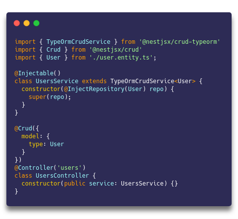

  <h1>:point_right:<a href="https://github.com/iscssoft/crud/issues/784">You can help NestJs CRUD
  </a></h1>

  <h1>CRUD</h1>

  <strong>for RESTful APIs built with NestJs</strong>

 

  
  
  
  
  
  
  
  
  
   

  Built with :purple_heart: by
  <a href="https://twitter.com/MichaelYali">@MichaelYali</a> and
  <a href="https://github.com/iscssoft/crud/graphs/contributors">
    Contributors
  </a>
  

    :star2: :eyes: :zap: :boom:
  

 

We believe that everyone who's working with NestJs and building some RESTful services and especially some CRUD functionality will find `@iscssoft/crud` microframework very useful.

## Features

- :electric_plug: Super easy to install and start using the full-featured controllers and services :point_right:

- :octopus: DB and service agnostic extendable CRUD controllers

- :mag_right: Reach query parsing with filtering, pagination, sorting, relations, nested relations, cache, etc.

- :telescope: Framework agnostic package with query builder for a frontend usage

- :space_invader: Query, path params and DTOs validation included

- :clapper: Overriding controller methods with ease

- :wrench: Tiny config (including globally)

- :gift: Additional helper decorators

- :pencil2: Swagger documentation

## Packages

- [**@iscssoft/crud**](https://www.npmjs.com/package/@iscssoft/crud) - core package which provides `@Crud()` decorator for endpoints generation, global configuration, validation, helper decorators ([docs](https://github.com/iscssoft/crud/wiki/Controllers#description))
- [**@iscssoft/crud-request**](https://www.npmjs.com/package/@iscssoft/crud-request) - request builder/parser package which provides `RequestQueryBuilder` class for a frontend usage and `RequestQueryParser` that is being used internally for handling and validating query/path params on a backend side ([docs](https://github.com/iscssoft/crud/wiki/Requests#frontend-usage))
- [**@iscssoft/crud-typeorm**](https://www.npmjs.com/package/@iscssoft/crud-typeorm) - TypeORM package which provides base `TypeOrmCrudService` with methods for CRUD database operations ([docs](https://github.com/iscssoft/crud/wiki/ServiceTypeorm))

## Documentation

- :dart: [General Information](https://github.com/iscssoft/crud/wiki#why)
- :video_game: [CRUD Controllers](https://github.com/iscssoft/crud/wiki/Controllers#description)
- :horse_racing: [CRUD ORM Services](https://github.com/iscssoft/crud/wiki/Services#description)
- :trumpet: [Handling Requests](https://github.com/iscssoft/crud/wiki/Requests#description)

## Support

Any support is welcome. At least you can give us a star :star:

## Contributors

### Code Contributors

This project exists thanks to all the people who contribute. [[Contribute](CODE_OF_CONDUCT.md)].

### Financial Contributors

Become a financial contributor and help us sustain our community. [[Contribute](https://opencollective.com/iscssoft#backer)]

#### Individuals

#### Organizations

Support this project with your organization. Your logo will show up here with a link to your website. [[Contribute](https://opencollective.com/iscssoft#sponsor)]

## License

[MIT](LICENSE)
